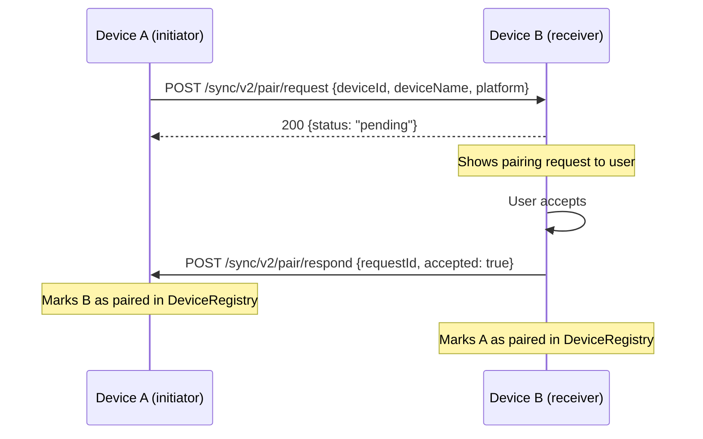
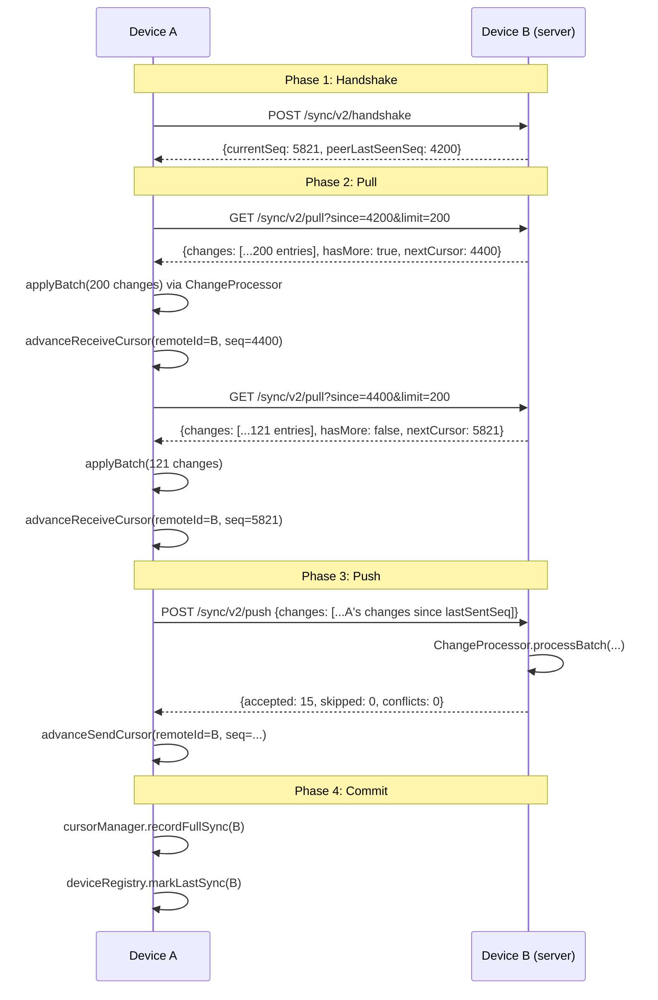
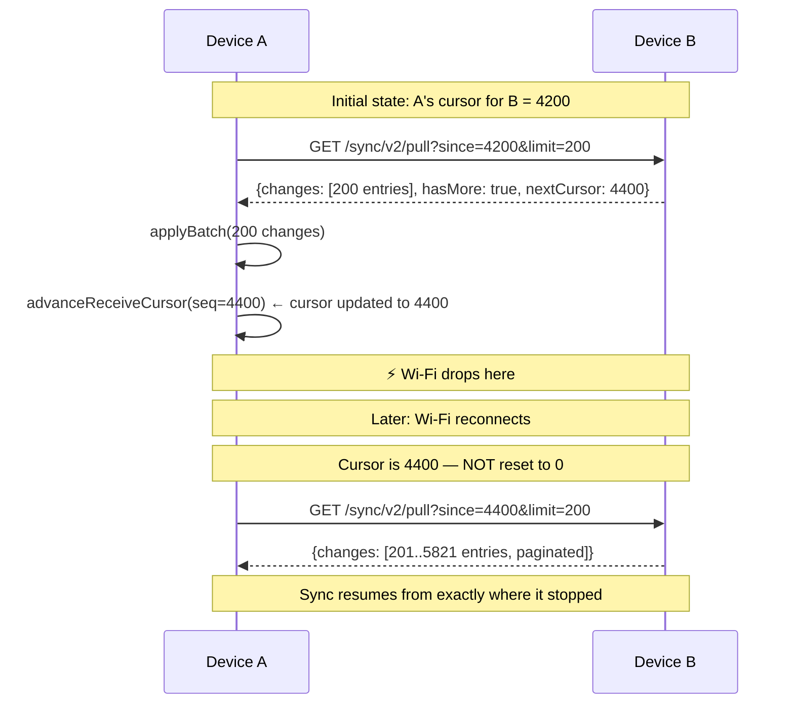

# SSMA Sync Architecture v2

> **Offline-first P2P Synchronization — Complete Technical Reference**

## Table of Contents

1. [Overview](#1-overview)
2. [Architecture Diagram](#2-architecture-diagram)
3. [Device Identity](#3-device-identity)
4. [Device Discovery](#4-device-discovery)
5. [Pairing Protocol](#5-pairing-protocol)
6. [Change Journal](#6-change-journal)
7. [Sync Cursors](#7-sync-cursors)
8. [Sync Protocol — Message Format](#8-sync-protocol--message-format)
9. [Sync Flow — Sequence Diagrams](#9-sync-flow--sequence-diagrams)
10. [Conflict Resolution](#10-conflict-resolution)
11. [Soft Deletes](#11-soft-deletes)
12. [Idempotency](#12-idempotency)
13. [Entity Registry](#13-entity-registry)
14. [Failure Recovery & Resume](#14-failure-recovery--resume)
15. [Device Permissions](#15-device-permissions)
16. [Database Schema](#16-database-schema)
17. [API Reference](#17-api-reference)
18. [Mobile Integration Guide](#18-mobile-integration-guide)
19. [Performance](#19-performance)
20. [Security](#20-security)
21. [Troubleshooting](#21-troubleshooting)
22. [Future Improvements](#22-future-improvements)

---

## 1. Overview

SSMA is an **offline-first** sales and inventory management application. Every device maintains a complete, independent local database (Isar/SQLite). Devices synchronize with each other **peer-to-peer over a local Wi-Fi network** — no cloud server, no internet dependency.

### Design Principles

| Principle | Implementation |
|-----------|---------------|
| **Git-like** | Every DB change is an immutable journal entry. Sync = replay journal entries in order. |
| **Incremental** | Only transfer changes newer than the last sync cursor. Never compare full tables. |
| **Resumable** | Cursors are only advanced after both sides confirm success. Interrupted sync resumes from exactly where it stopped. |
| **Idempotent** | Every change has a UUID (`changeId`). Receiving the same change twice is safe — the second delivery is silently ignored. |
| **Conflict-aware** | Pluggable conflict resolution strategies. Default: Highest Version Wins. |
| **Soft deletes** | Deletions are journal events. They propagate to all paired devices. |
| **Trust-based** | Only explicitly paired devices may exchange data. |

---

## 2. Architecture Diagram

```
┌─────────────────────────────────────────────────────────────────┐
│                     Device A (Android)                          │
│                                                                 │
│  ┌──────────────┐  ┌──────────────┐  ┌────────────────────┐   │
│  │  Business    │  │  ChangeJour  │  │  DeviceDiscovery   │   │
│  │  Logic       │──▶  nal (v2)   │  │  Service (mDNS)    │   │
│  │  (DBService) │  │  (Isar)     │  │                    │   │
│  └──────────────┘  └──────┬──────┘  └────────────────────┘   │
│                            │                    │               │
│                     ┌──────▼──────┐   ┌─────────▼──────────┐  │
│                     │ SyncManager │   │  LocalSyncServer   │  │
│                     │ (push+pull) │   │  (Shelf HTTP :8080)│  │
│                     └──────┬──────┘   └────────────────────┘  │
│                            │                    ▲               │
└────────────────────────────┼────────────────────┼───────────────┘
                             │   LAN (Wi-Fi)       │
                             ▼                    ▼
┌─────────────────────────────────────────────────────────────────┐
│                     Device B (iOS)                              │
│  Mirror of Device A's architecture                              │
└─────────────────────────────────────────────────────────────────┘
```

### Service Responsibility Map

| Service | Responsibility |
|---------|---------------|
| `ChangeJournal` | Append-only journal of all DB mutations |
| `CursorManager` | Tracks per-device sync position |
| `EntityRegistry` | Maps entity type strings to sync handlers |
| `ChangeProcessor` | Applies incoming journal entries via EntityRegistry |
| `ConflictResolver` | Pluggable conflict resolution strategies |
| `DeviceRegistry` | Stores all discovered/paired devices |
| `SyncManager` | Orchestrates handshake → pull → push → commit |
| `LocalSyncServer` | Shelf HTTP server — makes this device a sync endpoint |
| `DeviceDiscoveryService` | mDNS advertisement + discovery + subnet probe |
| `SyncInitializerV2` | Top-level coordinator — wires everything together |

---

## 3. Device Identity

Every SSMA installation has a permanent **Device ID** (UUID v4) stored in `SharedPreferences`. It never changes, even after app updates.

```
Key: ssma_v2_device_id
Key: ssma_v2_device_name
```

The Device ID is the authoritative identity used in:
- The change journal (`originDeviceId`)
- Per-device cursors (`remoteDeviceId`)
- HTTP headers (`x-device-id`)
- mDNS TXT records
- Pairing requests

---

## 4. Device Discovery

### mDNS / Bonjour

Devices advertise themselves using the NSD package:

```
Service type: _ssmasync2._tcp
Service name: ssma2_{deviceId}

TXT records:
  deviceId:        {UUID}
  deviceName:      {Human name}
  platform:        android | ios | macos | windows | linux
  appVersion:      1.0.0
  protocolVersion: 2
```

On startup:
1. `register()` — advertise this device on the LAN
2. Wait 2 seconds (Android NSD race condition mitigation)
3. `startDiscovery()` — listen for other SSMA devices
4. Restart discovery after 3 seconds to catch pre-existing advertisers

### Subnet Fallback Probe

If no peers are found via mDNS after 20 seconds, the discovery service probes all 254 addresses in the local `/24` subnet:

```
For each IP in subnet:
  GET http://{ip}:8080/sync/v2/health
  If 200 → parse deviceId from response and register
```

This handles networks where mDNS multicast is blocked (e.g., enterprise Wi-Fi).

### Manual IP Connection

Users can type an IP address in the Sync Settings screen → Connect by IP.

---

## 5. Pairing Protocol

Only paired devices can exchange sync data. Pairing is explicit user action.



- New devices start as **unpaired** (discovered but cannot sync)
- The user sees pending pairing requests in the Sync Settings screen
- Unpairing is immediate — sync is refused on the next attempt
- Trust checks happen in `LocalSyncServer._trustMiddleware()` before any data route

---

## 6. Change Journal

The change journal (`SyncChangeLog` Isar collection) is the heart of the sync system.

### Schema

```dart
class SyncChangeLog {
  int id;              // Isar local PK (not synced)
  String changeId;     // UUID — globally unique, used for idempotency  ← CRITICAL
  int changeSeq;       // Monotonic local sequence — the sync cursor    ← CRITICAL
  String entityType;   // 'Product', 'Sale', 'Customer', ...
  String entityId;     // UUID of the affected entity
  String operation;    // 'CREATE' | 'UPDATE' | 'DELETE'
  int entityVersion;   // Version of the entity at time of change
  String originDeviceId; // Which device produced this change
  int timestampMs;     // Wall-clock time (not used for ordering)
  String payload;      // Full JSON snapshot of the entity
  String? previousChangeHash; // SHA-256 of previous change for this entity
  bool acknowledged;   // True once a peer has confirmed receipt
}
```

### Key Properties

- **Append-only**: journal entries are never modified or deleted (except by compaction)
- **Immutable**: `changeId` and `changeSeq` never change once written
- **Self-contained**: `payload` is the complete entity state — no partial patches
- **Ordered**: `changeSeq` is the only reliable ordering signal; never sort by timestamp

### Writing to the Journal

Every `DBService` mutation calls `_appendChangeLog` inside the **same** Isar write transaction as the entity write. This guarantees atomicity: if the entity write fails, the journal entry is also rolled back (and vice versa).

```dart
await isar.writeTxn(() async {
  await isar.products.put(product);  // entity write
  await _appendChangeLog(            // journal write
    entityType: 'Product',
    entityUuid: product.uuid,
    entityVersion: product.version,
    operation: 'CREATE',
    payload: product.toJson(),
  );
});
```

---

## 7. Sync Cursors

Each device maintains one `SyncCursor` per remote device it has synced with.

```
Device A's cursor for Device B:
  remoteDeviceId: "device-B-uuid"
  lastReceivedSeq: 5821     ← "I have seen B's changes up to seq 5821"
  lastSentSeq: 4200         ← "B has acknowledged our seq 4200"
```

### Cursor Advancement Rules

**Critical**: Cursors are only advanced **after both sides confirm success**.

- `advanceReceiveCursor()` is called only after `changeProcessor.processBatch()` succeeds and all changes are written to Isar
- `advanceSendCursor()` is called only after the peer returns HTTP 200 on `/sync/v2/push`
- If the connection drops before either confirmation, the cursor is NOT advanced
- The next sync session resumes from the same cursor position (safe replay)

---

## 8. Sync Protocol — Message Format

### Handshake Request

```json
POST /sync/v2/handshake
{
  "deviceId": "device-A-uuid",
  "protocolVersion": 2,
  "appVersion": "1.0.0"
}
```

### Handshake Response

```json
{
  "deviceId": "device-B-uuid",
  "deviceName": "Soumya's Phone",
  "platform": "android",
  "protocolVersion": 2,
  "currentSeq": 5821,
  "peerLastSeenSeq": 4200
}
```

### Pull Request

```
GET /sync/v2/pull?since=5821&limit=200
Headers: x-device-id: device-A-uuid
```

### Pull Response

```json
{
  "changes": [
    {
      "changeId": "uuid-v4",
      "changeSeq": 5822,
      "entityType": "Product",
      "entityId": "product-uuid",
      "operation": "UPDATE",
      "entityVersion": 3,
      "originDeviceId": "device-B-uuid",
      "timestampMs": 1720000000000,
      "payload": "{\"id\":\"...\", \"name\":\"Widget Pro\", ...}",
      "previousChangeHash": null
    }
  ],
  "nextCursor": 5822,
  "hasMore": false,
  "minSeq": 1,
  "currentSeq": 5822
}
```

### Push Request

```json
POST /sync/v2/push
Headers: x-device-id: device-A-uuid
{
  "senderDeviceId": "device-A-uuid",
  "changes": [ { ...same structure as pull response... } ]
}
```

### Push Response

```json
{
  "accepted": 15,
  "skipped": 2,
  "conflicts": 1,
  "errors": 0,
  "currentSeq": 5840
}
```

---

## 9. Sync Flow — Sequence Diagrams

### Normal Sync (Device A pulls from Device B)



### Interrupted Sync (Resume)



---

## 10. Conflict Resolution

A conflict occurs when **both Device A and Device B modify the same entity** while offline, and the change from B arrives at A after A has already applied its own version.

Detection: `incoming.entityVersion <= existing.entityVersion` (after the entity already exists locally).

### Built-in Strategies

| Strategy | Behavior | Use case |
|----------|----------|----------|
| `HighestVersionWins` (**default**) | Higher version number wins | Safe default; predictable |
| `LastWriteWins` | More recent wall-clock time wins | When timestamps are reliable |
| `ServerWins` | Local (receiver) always wins | When local device is authoritative |
| `ClientWins` | Incoming (sender) always wins | When sender is authoritative |

### Tie-breaking

When two strategies result in equal priority (same version, same timestamp), a deterministic **lexicographic device ID tiebreaker** is used. This guarantees all devices arrive at the same resolution without coordination.

```
larger deviceId string → wins
```

### Adding a Custom Strategy

```dart
class FieldLevelMergeStrategy implements ConflictStrategy {
  @override
  String get name => 'FieldLevelMerge';

  @override
  ConflictOutcome resolve(ConflictContext ctx) {
    // Custom logic: merge individual fields
    // Return applyIncoming or keepExisting
  }
}

// At startup:
syncV2!.conflictResolver.setStrategy(FieldLevelMergeStrategy());
```

---

## 11. Soft Deletes

Physical deletion is **never used** for synchronized entities.

When a record is deleted:

```dart
product.deleted = true;       // isDeleted flag
product.updatedAt = now;
product.version += 1;         // version bump signals the change
await _appendChangeLog(
  operation: 'DELETE',        // explicit DELETE operation in journal
  ...
);
```

The DELETE journal entry propagates to all paired devices. On receipt, the handler sets `entity.isDeleted = true` on the local copy. The record remains in the database but is excluded from all queries via `filter().deletedEqualTo(false)`.

Benefits:
- Deletion history is preserved in the journal
- Deleted entities don't get re-created if received out of order
- Audit trail is complete

---

## 12. Idempotency

Every `SyncChangeLog` has a globally unique `changeId` (UUID v4).

When a push batch is received at `POST /sync/v2/push`, the `ChangeProcessor` checks:

```dart
final existing = await isar.syncChangeLogs
    .filter()
    .changeIdEqualTo(change.changeId)
    .findFirst();
if (existing != null) {
  return _ApplyResult.duplicate; // silently skip
}
```

This means:
- Retries after a network timeout are completely safe
- Duplicate packets (from split batches) are handled
- Re-delivering the entire journal history causes no data corruption

The `changeId` uniqueness index is enforced at the Isar schema level.

---

## 13. Entity Registry

The `EntityRegistry` eliminates the giant `if/else if` chain that plagued the v1 sync engine. Adding sync support for a new entity type is **one line of code**.

### Adding a New Syncable Entity

1. Implement `EntitySyncHandler<YourEntity>`:

```dart
class WidgetSyncHandler implements EntitySyncHandler {
  @override
  String get entityType => 'Widget';

  @override
  Future<void> applyChange(
    Map<String, dynamic> payload,
    String operation,
    ConflictResolver conflictResolver,
    Isar isar,
  ) async {
    final incoming = Widget.fromJson(payload);
    final existing = await isar.widgets.filter().uuidEqualTo(incoming.uuid).findFirst();

    if (existing == null) {
      await isar.widgets.put(incoming);
      return;
    }
    // Handle UPDATE / DELETE with conflict resolution...
  }
}
```

2. Register in `EntityRegistry.registerAll()`:

```dart
static void registerAll({required Isar isar}) {
  register(ProductSyncHandler());
  register(CustomerSyncHandler());
  // ... existing handlers ...
  register(WidgetSyncHandler());  // ← ONE LINE
}
```

3. Add `Widget` schema to `Isar.open()` in `DBService.initializeIsar()`.

4. Run `flutter pub run build_runner build` to generate `.g.dart` files.

That's it. The sync engine picks it up automatically.

---

## 14. Failure Recovery & Resume

### Crash During Pull

- Cursor was advanced for each page after successful apply
- On restart, pull resumes from the last committed cursor
- Already-applied changes are skipped via `changeId` deduplication
- Net result: zero data loss, at most re-fetching one partial page

### Crash During Push

- `advanceSendCursor()` was not called (no HTTP 200 received)
- On restart, push re-sends from the last confirmed `lastSentSeq`
- Peer's `ChangeProcessor` deduplicates via `changeId`
- Net result: zero data loss, at most re-sending one batch

### Wi-Fi Disconnect Mid-Sync

- Same as crash — cursor not advanced for un-confirmed pages
- `SyncManager` has `_maxRetries = 3` with exponential backoff (2s, 4s, 8s)
- After exhausting retries, device is marked `connectionStatus = 'unreachable'`
- Next sync session (triggered by discovery or periodic timer) retries

### Compaction Gap

If a peer has pruned their journal history (compaction), and our cursor is below their `minSeq`:

```
peer.minSeq = 1000
our cursor = 500 → gap!
```

`SyncManager._pullPhase()` detects this and resets the cursor to `minSeq - 1`, accepting that we may miss those early entries (they are presumed already applied from previous syncs).

---

## 15. Device Permissions

Each `PeerDevice` record carries per-device permission flags:

| Flag | Description |
|------|-------------|
| `receiveEnabled` | Whether to accept incoming changes from this device |
| `sendEnabled` | Whether to push our changes to this device |
| `autoSyncEnabled` | Whether to include in periodic auto-sync cycles |
| `isPaired` | Whether this device is trusted at all |

Permission checks happen at two levels:
1. **Server-side** (`LocalSyncServer`): The push handler checks `peer.receiveEnabled` before processing
2. **Client-side** (`SyncManager._syncWithPeer`): Skips push/pull phases based on `sendEnabled`/`receiveEnabled`

---

## 16. Database Schema

### SyncChangeLog

```
Table: sync_change_logs
├── id            INTEGER    PK (Isar autoincrement, device-local)
├── changeId      TEXT       UNIQUE (UUID, sync identity)
├── changeSeq     INTEGER    INDEX (monotonic sequence, sync cursor)
├── entityType    TEXT       INDEX
├── entityId      TEXT       INDEX
├── operation     TEXT       ('CREATE' | 'UPDATE' | 'DELETE')
├── entityVersion INTEGER
├── originDeviceId TEXT      INDEX
├── timestampMs   INTEGER
├── payload       TEXT       (full JSON entity snapshot)
├── previousChangeHash TEXT  NULLABLE
└── acknowledged  BOOLEAN    INDEX
```

### PeerDevice

```
Table: peer_devices
├── id              INTEGER    PK
├── deviceId        TEXT       UNIQUE, INDEX
├── deviceName      TEXT
├── platform        TEXT
├── appVersion      TEXT
├── lastKnownIp     TEXT
├── lastKnownPort   INTEGER    (default: 8080)
├── lastSeenMs      INTEGER    INDEX
├── lastSyncMs      INTEGER
├── connectionStatus TEXT      INDEX ('unknown'|'reachable'|'unreachable'|'syncing')
├── isPaired        BOOLEAN    INDEX
├── pairedAtMs      INTEGER    NULLABLE
├── receiveEnabled  BOOLEAN
├── sendEnabled     BOOLEAN
├── autoSyncEnabled BOOLEAN
├── registeredAtMs  INTEGER
└── osVersion       TEXT       NULLABLE
```

### SyncCursor

```
Table: sync_cursors
├── id              INTEGER    PK
├── remoteDeviceId  TEXT       UNIQUE (one row per paired device)
├── lastReceivedSeq INTEGER    (pull cursor)
├── lastSentSeq     INTEGER    (push cursor)
├── lastPullMs      INTEGER
├── lastPushMs      INTEGER
├── lastFullSyncMs  INTEGER
├── lastPullCount   INTEGER
├── lastPushCount   INTEGER
├── totalReceived   INTEGER
└── totalSent       INTEGER
```

### PairingRequest

```
Table: pairing_requests
├── id                   INTEGER    PK
├── requestId            TEXT       UNIQUE
├── initiatorDeviceId    TEXT       INDEX
├── initiatorDeviceName  TEXT
├── initiatorPlatform    TEXT
├── initiatorIp          TEXT
├── status               TEXT       INDEX ('pending'|'accepted'|'rejected'|'expired')
├── receivedAtMs         INTEGER
├── respondedAtMs        INTEGER    NULLABLE
└── isInitiator          BOOLEAN
```

---

## 17. API Reference

All endpoints are served by `LocalSyncServer` on port **8080**.

### Public endpoints (no auth required)

| Method | Path | Description |
|--------|------|-------------|
| `GET` | `/sync/v2/health` | Liveness probe + device metadata |
| `POST` | `/sync/v2/handshake` | Protocol negotiation |
| `POST` | `/sync/v2/pair/request` | Initiate pairing |
| `POST` | `/sync/v2/pair/respond` | Accept/reject pairing |

### Authenticated endpoints (requires `x-device-id` header + pairing)

| Method | Path | Description |
|--------|------|-------------|
| `GET` | `/sync/v2/pull?since={seq}&limit={n}` | Incremental pull (paginated) |
| `POST` | `/sync/v2/push` | Receive a batch of changes |
| `GET` | `/sync/v2/diagnostics` | Debug info (debug mode only) |

---

## 18. Mobile Integration Guide

### App Startup

```dart
// In main.dart, after DBService.initializeIsar()
syncV2 = SyncInitializerV2(port: 8080);
await syncV2!.initialize();
```

### Writing Data (triggers sync automatically)

```dart
// DBService handles journal + sync trigger:
await DBService.addProduct(product);
// ↑ This also writes to SyncChangeLog and calls syncV2.triggerDebouncedSync()
```

### Manual Sync Trigger

```dart
await syncV2!.syncManager.syncWithAllPeers();
```

### Force Full Re-sync

```dart
await syncV2!.forceFullSync();
// Resets all cursors to 0 then syncs
```

### App Shutdown

```dart
await syncV2?.shutdown();
```

---

## 19. Performance

### Batch Size

Pull and push operations use a batch size of **200 changes per request** (`SyncManager._batchSize`). This is configurable without changing the protocol.

### Memory Efficiency

- Only one batch is in memory at a time during sync
- Isar queries are lazy — no full-table loads
- JSON payload serialization is per-entity at write time, not per-sync

### Large Offline Periods

If a device was offline for 2 days with 10,000 changes:
- Pull requires `ceil(10000 / 200)` = 50 HTTP requests
- Each request is bounded at 200 records
- Total memory peak ≈ 200 records × avg payload size

### Indexing

`SyncChangeLog.changeSeq` is indexed — the pull query `changeSeq > since` uses the index efficiently even with millions of journal entries.

---

## 20. Security

### Trust Enforcement

All data endpoints check `x-device-id` and verify pairing in `_trustMiddleware`. Unpaired devices receive `403 Forbidden`.

### Replay Attack Protection

`changeId` UUID uniqueness prevents replaying old changes — duplicates are detected and ignored before any entity is modified.

### Protocol Version Enforcement

Handshake returns `426 Upgrade Required` for protocol versions < 2, preventing data corruption from incompatible old clients.

### Planned (Future)

- HMAC-signed request bodies using a shared secret established at pairing
- Certificate pinning for the local HTTP server

---

## 21. Troubleshooting

### Device not discovered

1. Verify both devices are on the same Wi-Fi SSID (not guest network)
2. Check that mDNS multicast is not blocked by the router
3. Use "Connect by IP" as fallback
4. Check logs for `[Discovery]: ❌` messages

### Sync stuck / slow

1. Check `connectionStatus` of the peer in the Sync Settings screen
2. Look for `[SyncManager]: ❌` in the debug log
3. Try "Sync Now" manually to force a retry
4. If cursors seem wrong, use "Reset Cursor" for that device

### Conflict happening too often

1. Check the conflict strategy in Diagnostics tab
2. Consider switching to `LastWriteWinsStrategy` if timestamps are reliable
3. Audit that `version` is being incremented correctly in all update paths

### Data missing after sync

1. Verify the entity type is registered in `EntityRegistry.registerAll()`
2. Check that `DBService.addXxx()` calls `_appendChangeLog` with `entityUuid`
3. Look for `[ChangeProcessor]: ⚠ no handler for entityType=...` in logs

---

## 22. Future Improvements

| Feature | Description |
|---------|-------------|
| **HMAC signatures** | Sign push payloads with a shared secret to prevent tampering |
| **Field-level merge** | Resolve conflicts by merging individual fields (e.g., for settings) |
| **WebSocket push** | Replace polling with server-sent events for instant change notification |
| **Bluetooth sync** | P2P sync over BLE for devices not on the same Wi-Fi |
| **Sync over USB** | adb-based sync for air-gapped environments |
| **Merkle tree validation** | Detect journal corruption by comparing hash trees |
| **Compression** | gzip batch payloads to reduce LAN traffic |
| **Partial sync** | Allow sync of specific entity types only (e.g., sync Products but not Sales) |
| **Sync scheduling** | Allow per-device sync schedules (e.g., sync only at night) |
| **Journal archiving** | Archive old journal entries to a separate file instead of deleting them |
