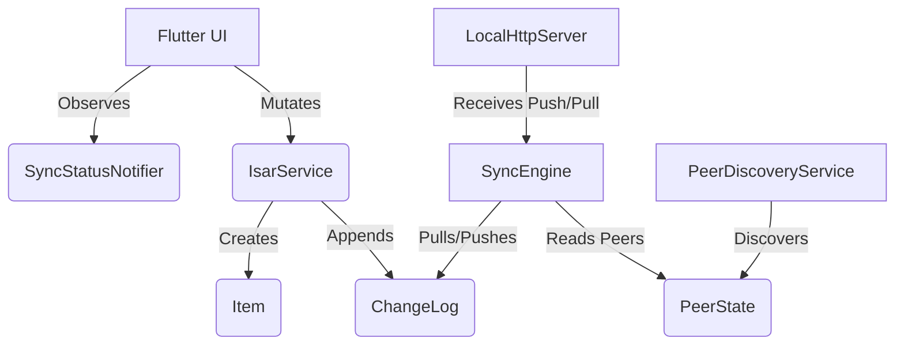
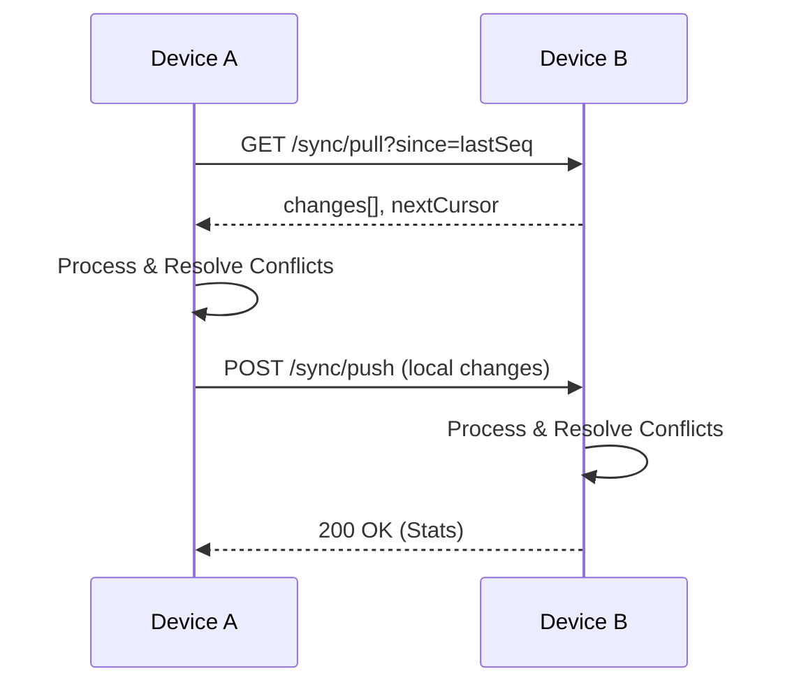

# Local-First Synchronization Architecture Guide

## 1. Architecture Overview
This local-first synchronization architecture is designed to enable Flutter applications to store data locally via Isar database and sync seamlessly across devices on the same LAN/WiFi. It operates entirely peer-to-peer (P2P), removing the need for a centralized cloud server.

## 2. System Diagram

## 3. Component Descriptions
- **IsarService**: Manages the local DB, performs CRUD operations, and guarantees a `ChangeLog` entry is appended for every mutation.
- **SyncEngine**: The orchestrator that periodically loops through known peers, pulls missing changes, pushes local changes, and delegates conflict resolution.
- **PeerDiscoveryService**: Uses multicast DNS (mDNS) to advertise and discover other devices running the same app.
- **LocalHttpServer**: A `shelf`-based HTTP server that listens for sync requests (`GET /sync/pull`, `POST /sync/push`) and delegates to the `SyncEngine`.
- **ConflictResolver**: Implements a deterministic strategy to merge conflicting edits on the same `Item`.
- **DataCompactor**: Cleans up older `ChangeLog` entries to save local disk space.

## 4. Data Flow
1. User creates or updates an `Item` via the UI.
2. `IsarService` saves the `Item` and simultaneously appends a `ChangeLog` record with a new `changeSeq` in a single transaction.
3. The `SyncEngine`'s debounce timer triggers.
4. It calls `pushToPeer` for all healthy peers, sending the new `ChangeLog`.
5. The peer's `LocalHttpServer` receives the payload, verifies the token, and passes it to its `SyncEngine`.
6. The peer resolves conflicts and saves the item locally.

## 5. Sync Lifecycle
- **Periodic Sync**: Every 30 seconds, the app tries to pull and push with all peers.
- **Debounced Sync**: After a local write, it waits 2 seconds before proactively pushing to peers.
- **Background**: The server and discovery service run as long as the app is alive. 

## 6. Conflict Resolution Explanation
Conflicts occur when two devices modify the same record while disconnected. We use a deterministic merge strategy:
1. **Higher Version Wins**: The record with the most edits wins.
2. **Newer updatedAt Wins**: If versions tie, the latest timestamp wins.
3. **Lexicographical Device ID**: The ultimate tie-breaker ensures all devices converge to the exact same state deterministically.

## 7. Changelog Explanation
The `ChangeLog` is an append-only, immutable event log. Every mutation yields an entry with a monotonically increasing `changeSeq`. This `changeSeq` acts as a cursor for incremental sync, ensuring we only pull what we don't have.

## 8. Peer Discovery Explanation
The app uses mDNS to advertise `_sync_service._tcp.local`. The `PeerDiscoveryService` listens for these broadcasts, extracts the IP and port, and updates the `PeerState` table. Stale peers (unseen for a threshold) are ignored during sync.

## 9. API Reference
- `GET /health`: Returns `{deviceId, currentChangeSeq, appVersion, uptime}`
- `GET /sync/pull?since=0&limit=100`: Returns `{changes: [...], nextCursor: 100, hasMore: true}`
- `POST /sync/push`: Accepts `{changes: [...]}` and returns `{accepted, rejected, duplicate}`

## 10. Sequence Diagrams

## 11. Offline Behavior
While offline, all writes are appended locally to `ChangeLog`. The `SyncStatus` switches to `offline` or `idle`. The user continues using the app without interruption.

## 12. Recovery Behavior
When the network returns, mDNS discovers peers again. The `SyncEngine` initiates a periodic sync. Using cursors (`lastPulledChangeSeq`), it fetches all missed events and pushes local offline edits. Catch-up is automatic and guaranteed by idempotency.

## 13. Security Model
All HTTP endpoints require an `x-sync-token` header. This shared secret must be pre-configured or exchanged via QR code between devices to prevent unauthorized devices from reading or mutating the local database.

## 14. Troubleshooting Guide
- **No Peers Found**: Ensure both devices are on the same subnet and router allows multicast/mDNS traffic.
- **Sync Stuck**: Check the `/health` endpoint manually via cURL to ensure the local HTTP server is running.
- **Data Mismatch**: Ensure system clocks are reasonably synchronized (though conflict resolution mitigates this, extreme clock skew can cause unexpected overwrites).

## 15. Debugging Guide
- Print `changeSeq` cursors to see if they advance.
- Inspect the `SyncMetrics` notifier in Flutter DevTools to see success/failure counts.
- Use Wireshark to trace mDNS packets and HTTP requests on port 8080.

## 16. Performance Considerations
- **Chunking**: Changes are pulled in chunks of 100 to prevent OOM errors and timeouts.
- **Debouncing**: Rapid local edits do not flood the network; they are batched via a 2-second debounce.
- **Isar Txns**: Operations are batched in a single Isar `writeTxn` for speed.

## 17. Known Limitations
- Background execution when the app is killed is not supported natively by Flutter without native background services (e.g., Workmanager).
- mDNS can be flaky on corporate/hotel WiFi networks that block multicast.

## 18. Future Improvements
- Implement WebRTC for peer connection over internet/NAT traversal.
- Vector clocks for more robust conflict resolution.
- Native background sync tasks for Android/iOS.

## 19. FAQ
- **Is a server required?** No, devices sync directly.
- **What if a device crashes mid-sync?** The `opId` ensures idempotency. Retries are safe.

## 20. Developer Onboarding Guide
1. Import `package:ssma/sync/sync_engine.dart`.
2. Initialize `IsarService` and `SyncEngine` in your `main.dart`.
3. Pass your specific `deviceId` (e.g. from `uuid` or `device_info_plus`).
4. Wrap your UI with `Consumer<SyncStatusNotifier>` to show syncing indicators.
5. Use `IsarService.saveItem()` for all mutations instead of raw Isar calls to ensure `ChangeLog` integrity.
